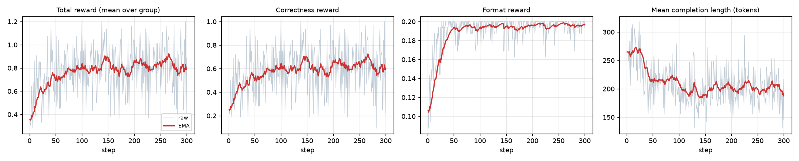

# grpo-lab

A minimal, readable GRPO (Group Relative Policy Optimization) training setup for small
LLMs on a task with a verifiable reward. It is built on
[TRL](https://github.com/huggingface/trl)'s `GRPOTrainer` + PEFT LoRA, fits on an
8 GB consumer GPU for a ~0.5B model, and scales to an ~8B model with one config change
(QLoRA) on a bigger GPU.

Task: [GSM8K](https://huggingface.co/datasets/openai/gsm8k) grade-school math. The model
reasons freely and ends with `\boxed{<number>}`; the reward is 1 if that number matches the
gold answer. No learned reward model, no SFT stage, no human labels.

```
prompt ──► policy samples G=8 completions ──► reward each (correct? formatted?)
                                                       │
              advantage_i = (r_i − mean(r)) / std(r)  ◄┘      (group-relative)
                                                       │
       policy-gradient step on the LoRA weights  ◄─────────┘   (no critic, no ref model)
```

## Results

One run, `configs/qwen2.5-0.5b-gsm8k.yaml`, on a single **RTX 4060 (8 GB)** under WSL2.
Base model: [Qwen/Qwen2.5-0.5B-Instruct](https://huggingface.co/Qwen/Qwen2.5-0.5B-Instruct).
300 GRPO steps × 4 prompts × 8 samples = 9,600 rollouts over ~1,200 GSM8K train problems
(16% of one epoch). Evaluation is greedy decoding on the **full GSM8K test set (1,319 problems)**,
answer = number inside the last `\boxed{}`.

| model | n | GSM8K acc (greedy) | numeric `\boxed{}` rate | mean completion chars |
|---|---|---|---|---|
| `Qwen/Qwen2.5-0.5B-Instruct` (base) | 1319 | **39.1%** | 84.7% | 981 |
| + GRPO LoRA (this repo, 300 steps) | 1319 | **49.7%** | 99.6% | 643 |

**+10.5 points** (paired bootstrap 95% CI **[+7.7, +13.3]**; McNemar exact p ≈ 1e-12).
261 problems flipped wrong→right, 122 right→wrong.



| | first 25 steps | last 25 steps |
|---|---|---|
| mean correctness reward on rollouts (T=1.0) | 0.43 | 0.59 |
| mean completion length (tokens) | 267 | 196 |
| rollouts truncated at 384 tokens | 17% | 1.4% |

Cost: 2h01m training (23.9 s/step), 2 × ~15 min eval, peak 7.9 GB VRAM.

**Where the gain comes from.** Split the test set by whether the *base* model produced a
`\boxed{}` at all, so both models are scored on the same problems:

| subset (fixed by base-model behaviour) | n | base acc | GRPO acc | net problems gained |
|---|---|---|---|---|
| base produced a `\boxed{}` | 1117 | 46.2% | 50.3% | +46 |
| base produced no `\boxed{}` | 202 | 0.0% | 46.0% | +93 |

1. *Termination / format* (about two thirds of the headline). The base model leaves 202 of
   1,319 answers without a `\boxed{}` (rambles into the length limit, or re-derives the
   problem after answering). After GRPO that drops to 5, and the model gets 46% of those
   202 right. The 0.2 format bonus plus the fact that truncated rollouts score 0 make "stop
   after the box" a strongly rewarded behaviour.
2. *Actual reasoning* (about one third). On the 1,117 problems the base model already
   answered in the right format, accuracy goes 46.2% → 50.3% (+4.1 points). The model more
   often carries all the steps of a multi-step problem through (see example).

Both are real improvements on the task, but if you care only about (2), read the
fixed-subset number, not the headline. (Comparing "accuracy given a box" across the two
models directly, 46.2% → 49.8%, is misleading because the denominators are different sets
of problems.)

<details>
<summary>Example: base model skips the second step, GRPO model doesn't (test problem, greedy)</summary>

> Nissa hires 60 seasonal workers to play elves in her department store's Santa village.
> A third of the elves quit after children vomit on them, then 10 of the remaining elves
> quit after kids kick their shins. How many elves are left? (gold: 30)

**Base** — computes 60/3 = 20, 60 − 20 = 40, answers `\boxed{40}`. Never applies the "then 10 quit".

**GRPO** — 60/3 = 20 → 40 remain → 40 − 10 = 30 → `\boxed{30}`.

Every completion for every test problem, before and after, is in
`results/qwen2.5-0.5b-gsm8k/eval_{before,after}.json` if you want to diff behaviours yourself.
</details>

**Caveats.** Single seed. GSM8K train and test are disjoint but the same distribution, so this
is in-distribution improvement, not a claim about general reasoning. The reward curve
plateaus after ~100 steps and `frac_reward_zero_std` climbs to ~45% by the end (nearly half
the prompts are either always-solved or never-solved by the sampler and give no gradient);
the standard remedies are a larger model, harder problems, or dynamic sampling (DAPO).
The trained LoRA adapter is 70 MB and not committed; `scripts/run_experiment.sh` reproduces it.

The 7B config (`configs/qwen2.5-7b-gsm8k.yaml`) has **not** been run — it needs a ≥24 GB GPU.
Expected behaviour from the literature: Qwen2.5-7B-Instruct starts around 85-90% on GSM8K,
so gains there are a few points at most and a harder dataset (MATH, GSM-Hard) is a better target.

## Repo layout

```
grpo_lab/
  data.py        GSM8K loading, prompt template, gold-answer parsing
  rewards.py     correctness_reward (1.0 / 0.0) and format_reward (0.2 / 0.0)
  train.py       YAML config -> GRPOConfig + LoRA/QLoRA -> GRPOTrainer -> adapter
  evaluate.py    greedy pass@1 on GSM8K test (before / after), dumps every completion
  plot.py        reward / length curves from trainer_state.json
  summarize.py   markdown table from the two eval files
configs/
  qwen2.5-0.5b-gsm8k.yaml   the run reported above (8 GB GPU)
  qwen2.5-7b-gsm8k.yaml     same recipe, ~8B model, 4-bit QLoRA (needs >=24 GB GPU)
scripts/
  setup.sh                  uv venv + CUDA torch + deps
  run_experiment.sh         baseline eval -> train -> eval -> plots -> summary
results/<run_name>/         eval_before.json, eval_after.json, train_log.csv, curves.png, summary.md
tests/                      unit tests for the answer parser and rewards
```

## Quick start

```bash
git clone https://github.com/gian-g3dai/grpo-lab && cd grpo-lab
scripts/setup.sh                                   # needs uv + an NVIDIA GPU
.venv/bin/python -m pytest tests                   # reward parser sanity checks

# whole pipeline for the small model (baseline eval, GRPO, eval, plots)
scripts/run_experiment.sh configs/qwen2.5-0.5b-gsm8k.yaml

# or step by step
.venv/bin/python -m grpo_lab.evaluate --model Qwen/Qwen2.5-0.5B-Instruct --out results/x/eval_before.json --limit 200
.venv/bin/python -m grpo_lab.train    --config configs/qwen2.5-0.5b-gsm8k.yaml --max-steps 20
.venv/bin/python -m grpo_lab.evaluate --model Qwen/Qwen2.5-0.5B-Instruct --adapter outputs/qwen2.5-0.5b-gsm8k/final --out results/x/eval_after.json --limit 200
.venv/bin/python -m grpo_lab.plot     --state outputs/qwen2.5-0.5b-gsm8k/final/trainer_state.json --out results/x/curves.png
```

### Running the ~8B model

```bash
scripts/run_experiment.sh configs/qwen2.5-7b-gsm8k.yaml
```

The 7B config loads [Qwen/Qwen2.5-7B-Instruct](https://huggingface.co/Qwen/Qwen2.5-7B-Instruct)
in 4-bit (NF4) and trains a LoRA on top. Rough memory budget: ~5 GB weights + KV cache for
8 × 512-token rollouts + LoRA grads/optimizer ≈ 20-24 GB, so an A10G / L4 / 3090 / 4090
works. On a 40 GB+ card, uncomment the `use_vllm` block in the config for much faster
rollouts. Any HF causal LM works in the `model:` field; swap in
[Qwen/Qwen3-8B](https://huggingface.co/Qwen/Qwen3-8B) or
[meta-llama/Llama-3.1-8B-Instruct](https://huggingface.co/meta-llama/Llama-3.1-8B-Instruct)
(gated) and adjust `target_modules` if the projection names differ.

## How the pieces fit

* **Data** (`data.py`): each GSM8K row becomes a chat prompt (system + user) and a gold
  string. The system prompt asks for step-by-step reasoning and a final `\boxed{}` answer
  (the format Qwen instruct models already use natively, so the baseline is meaningful).
* **Rewards** (`rewards.py`): plain Python functions with the TRL signature
  `f(completions, **columns) -> list[float]`. `correctness` parses the last `\boxed{}` and
  compares numbers; `format` pays 0.2 for exactly one `\boxed{}` followed by at most a short
  tail (rewards stopping after the answer; penalises hedging with several boxes).
  TRL sums the rewards (weights configurable via `reward_weights`).
* **Trainer** (`train.py`): every key under `grpo:` in the YAML is a `trl.GRPOConfig`
  field, so the [TRL GRPO docs](https://huggingface.co/docs/trl/grpo_trainer) apply
  verbatim. `lora:` builds a `peft.LoraConfig`; `quantization.load_in_4bit` builds a
  `BitsAndBytesConfig`. Output is a LoRA adapter plus `trainer_state.json`.
* **Eval** (`evaluate.py`): merges the adapter, greedy-decodes the test set in batches,
  writes accuracy, format rate and every completion to JSON so you can diff behaviours.

## Design notes / knobs that mattered

* `beta: 0.0` (no KL to a reference policy) is TRL's default and halves memory, since no
  frozen reference model is kept. With LoRA the policy can't drift far in 300 steps anyway.
* `num_generations: 8`, `per_device_train_batch_size: 4`, `gradient_accumulation_steps: 8`:
  one optimizer step sees 32 completions = 4 prompts. `generation_batch_size: 32` samples
  all of them in a single `generate()` call; the loss pass then runs in micro-batches of 4
  (half a group), which is what bounds the fp32-logits memory on an 8 GB card.
* The PPO-style clipping (`epsilon`) is a no-op in this setup. TRL's default
  `num_iterations: 1` does exactly one gradient pass per generation batch, so the policy
  that scored the rollouts is the policy being updated, the importance ratio is exactly 1,
  and `clip_ratio/*` is 0.0 at every step of the log. What actually runs is REINFORCE with
  group-normalised advantages. Clipping only matters if you raise `num_iterations`.
* `scale_rewards: group` is the original GRPO normalisation (divide by group std). Groups
  where every completion gets the same reward have zero advantage and contribute nothing;
  `frac_reward_zero_std` in the log tells you how many prompts are being wasted that way.
* Learning rate: full-parameter GRPO uses ~1e-6; LoRA needs ~10-20x that.
* HF `generate` (no vLLM) is the bottleneck on an 8 GB card. It is what makes the small
  run tractable in a single process; on a bigger GPU switch on `use_vllm`.

## References

* Shao et al., *DeepSeekMath: Pushing the Limits of Mathematical Reasoning in Open Language Models* (GRPO), 2024.
* DeepSeek-AI, *DeepSeek-R1*, 2025.
* [TRL GRPOTrainer docs](https://huggingface.co/docs/trl/grpo_trainer).
